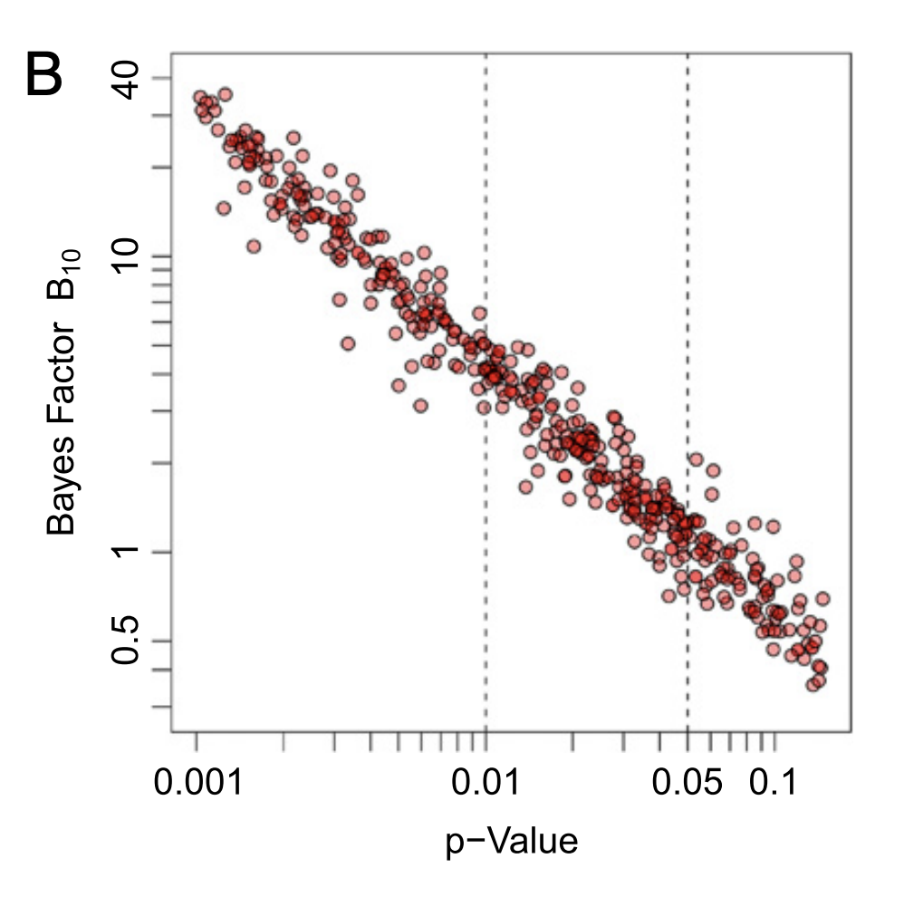

```{r setup, include=FALSE}
library(knitr)
knitr::opts_chunk$set(echo = TRUE, warning = FALSE, message = FALSE)
library(tidyverse)
library(broom)
library(ez)
library(BayesFactor)
```

# Bayes factors

Today we mainly cover

1. Introduction to probability and Bayes rule
2. Bayes factors
3. The BayesFactor R package

# Frequentist vs. Bayesian statistics

* In frequentist statistics the goal is to keep the rates of two types of errors low:
    * Type 1 error: reject null hypothesis when it is true
    * Type 2 error: fail to reject null when it is false
* In practice, often only type 1 error rates are considered
* In Bayesian statistics the goal is different: 
    * We want to know how to revise our beliefs given some data
* Bayes rule tells us how to do this
* Bayes factors quantify how much our beliefs should be revised given some data
    * This can be seen as a measure of how much evidence the data provides for a hypothesis (compared to another)
    
# Probability theory

* To quantify evidence we first need to quantify belief
* The Bayesian view is that: 
    * Probability quantifies belief
    * Probability theory is the theory of how to rationally update your beliefs
* The rationality of using probability theory has been justified in a number of different ways:
    * Cox's axioms (Cox, 1946)
    * Avoiding certain loss (Ramsey, 1926; de Finetti, 1935)

# Probability theory

* A probability is a number between 0 and 1 assinged to a statement (e.g. "it will rain tomorrow")
    * 1 represents complete certainty that the statement is true
    * 0 represents complete certainty that the statement is false
    * 0.5 represents "as likely as not to be true"
* Probabilities of complementary statements (of which exactly one must be true) sum to 1
    * e.g. P(it will rain tomorrow) + P(it will not rain tomorrow) = 1

# Probability distributions

* If we have a set of statements of which exactly one must be true, the total probability of 1 is distributed over these possibilites
* If the set is discrete then the assignemnt of probbaility to each statement defines a discrete probability distribution

```{r, fig.height=3, fig.width=5}
ggplot(data.frame(x=c(0,1,2,3,4,5), p=c(0.05, 0.35, 0.55, 0.043, 0.006, 0.001)), aes(x=x, y=p, group=1)) + geom_bar(stat="identity") + theme_classic() +
  labs(x="Cups of coffee I will drink tomorrow", y="Probability")
```

# Probability distributions

* Often we want to consider probability distributions on some contiuous variable, e.g. "how long will I need to wait for the U-bahn tomorrow morning"
* This is called a probability density function (PDF)
* The probability density function let's us compute probabilites of interval hypothesis, e.g. between 2 and 3, minutes by integrating the function over the relevant interval
* The integral of the PDF over all possible values of the continous variable equals one

```{r, fig.height=3, fig.width=5}
xp <- seq(0,15,0.001)
ggplot(data.frame(x=xp, p=dgamma(xp, 5*1.3, 1.3)), aes(x=x, y=p, group=1)) + geom_line() + theme_classic() +
  labs(x="Time spent waiting for U-bahn tomorrow morning", y="Probability density")
```


# Joint and conditional probability

* Often we need to consider the probability of multiple statements being true: joint probability
    * e.g. "I will drink two cups of coffee tomorow and wait 3 minutes for the U-bahn in the morning"
* The distribution over both sets of possibilites is called a joint probability distribution
* If they are independent then this is just the product of the individual probabilities 
    * e.g. P("two cups of coffee and wait 3 minutes") = P("two cups of coffee")*P("wait 3 minutes")
* Discrete joint probabiltiy distributions can be displayed as tables

```{r echo = FALSE}
data <- data.frame(t(matrix(c(c(0.05, 0.30, 0.6, 0.04, 0.009, 0.001)*0.3, c(0.065, 0.382, 0.51, 0.04, 0.002, 0.001))*0.7, 6, 2)))
row.names(data) <- c("not sunny", "sunny")
kable(data, col.names = c("0 cups", "1 cup", "2 cups", "3 cups", "4 cups", "5 cups"), row.names=TRUE, format="html")
```

# Joint and conditional probability

* In order to quantify updating of beliefs we need to consider conditional probabilities
* That is proabilities should change when we acquire new knowledge
* Conditional probability is written as P(A|B), meaning the probability that statement A is true given that statement B is true
* The product rule links joint and conditional probability: P(A,B) = P(A|B)P(B) = P(B|A)P(A)

# Joint and conditional probability

* If we pick one row or column in a table representation of a joint distribution and normalize it so the probabilities sum to one, this represents a conditional probability distribution

```{r echo = FALSE}
data <- data.frame(t(matrix(c(c(0.05, 0.30, 0.6, 0.04, 0.009, 0.001)*0.3, c(0.065, 0.382, 0.51, 0.04, 0.002, 0.001))*0.7, 6, 2)))
row.names(data) <- c("not sunny", "sunny")
kable(data, col.names = c("0 cups", "1 cup", "2 cups", "3 cups", "4 cups", "5 cups"), row.names=TRUE, format="html")
```

* For instance the probability distribution over different cups of coffe given that it will be sunny P(coffee|sunny) can be obtained by normalizing the lower row

```{r, fig.height=3, fig.width=5}
joint_coffee_sun <- c(0.0455, 0.2674, 0.3570, 0.0280, 0.0014, 0.0007)
coffee_given_sun <- joint_coffee_sun/sum(joint_coffee_sun)
ggplot(data.frame(x=c(0,1,2,3,4,5), p=coffee_given_sun), aes(x=x, y=p, group=1)) + geom_bar(stat="identity") + theme_classic() +
  labs(x="Cups of coffee I will drink tomorrow if it is sunny", y="Probability")
```

# Bayes rule

* Bayes rule tells us how to "invert" a conditional probability, i.e. how to get P(B|A) from P(A|B)
* Often we know the probability of some data given a model or hypothesis: P(D|H) 
    * This is often called the likelihood of the hypothesis/model L(H)=P(D|H)
    * When we talk about the likelihood the data is considered fixed (we are not uncertain about what the data are!)
    * The likelihood tells us how well a model explains the data
* And we want to know the probability that the hypothesis is true given the data: P(H|D)
    * This is often called the posterior probability

# Bayes rule
    
* We can derive Bayes rule from the two different ways of writing the product rule:
    * P(H,D) = P(H|D)*P(D) and P(H,D) = P(D|H)*P(H) 
* P(H|D)*P(D) = P(D|H)*P(H) 
* P(H) is usually called the prior probability
* $P(H|D) = \frac{P(D|H)*P(H)}{P(D)}$

# Bayes rule

* $P(H|D) = \frac{P(D|H)*P(H)}{P(D)}$
* The denominator in Bayes rule: P(D) can be written as: 
P(D) = $\sum_{i}P(D|H_{i})P(H_{i})$
* This is the average likelihood, weighted by the prior
* So Bayes rule can be written as posterior = prior*likelihood/average likelihood
* Notice that this means that our belief in hypotheses that explain the data better than average should grow while our belief in hypotheses that explain the data worse than average should shrink 

# Bayes rule - Example

* Let's say we are trying to determine the bias of a coin
* We flip it 40 times and it comes up heads 30 times

# Bayes rule - Example (prior distribution)

* The parameter $\theta$ here means the probability of the coin landing heads
* A Beta(2,2) prior means we consider small biases more likely than large

```{r, fig.height=3, fig.width=5}
xp <- seq(0,1,0.001)
prior <- dbeta(xp, 2,2)
ggplot(data.frame(x=xp, y=prior), aes(x=x, y=y, group=1)) + geom_line() + theme_classic() +
  labs(x=expression(theta), y="Prior density")
```

# Bayes rule - Example (likelihood)

* The blue broken line shows the average likelihood
* The broken black lines shows where the likelihood is larger than average

```{r, fig.height=3, fig.width=5}
likelihood <- dbinom(30, 40, xp)
avglikelihood <-  sum(prior*likelihood*0.001)
largelikelihood <- which(likelihood > avglikelihood)
ggplot(data.frame(x=xp, y=likelihood), aes(x=x, y=y, group=1)) + geom_line() + theme_classic() +
  labs(x=expression(theta), y="Likelihood") + 
  geom_hline(aes(yintercept=avglikelihood), color="blue", linetype=2) + 
  geom_vline(aes(xintercept=xp[min(largelikelihood)]), linetype=5) +
  geom_vline(aes(xintercept=xp[max(largelikelihood)]), linetype=5)
```

# Bayes rule - Example (prior and posterior)

* The posterior is larger than the prior inside the black lines, where the likelihood was larger than average

```{r, fig.height=3, fig.width=5}
posterior <- prior*likelihood/avglikelihood
ggplot(data.frame(x=rep(xp,2), y=c(prior,posterior), 
                  type=c(rep("prior", length(xp)), rep("posterior", length(xp)))), 
       aes(x=x, y=y, color=type, group=type)) + geom_line() + theme_classic() + labs(x=expression(theta), y="Posterior")  + 
  geom_vline(aes(xintercept=xp[min(largelikelihood)]), linetype=5) +
  geom_vline(aes(xintercept=xp[max(largelikelihood)]), linetype=5)
```

# Bayes factors

* A Bayes factor quantifies how much a set of data supports one model (or hypothesis) over another
* The formula for the Bayes factor can be derived by dividing Bayes rule for two mutually exclusive hypothesis:
  * Alternative hypothesis $H_{1}$: $P(H_{1}|D) = P(D|H_{1})P(H_{1})/P(D)$
  * Null hypothesis $H_{0}$: $P(H_{0}|D) = P(D|H_{0})P(H_{0})/P(D)$
* $\frac{P(H_{1}|D)}{P(H_{0}|D)} = \frac{P(D|H_{1})}{P(D|H_{0})} * \frac{P(H{1})}{P(H_{0})}$
* Posterior odds = Bayes factor * Prior odds
    * Odds means the ratio between the probability that a statement is true and the probability that it is false
    * e.g. if some event H has probability 75% = 3/4, then the odds of H are O(H) = P(H)/(1-P(H)) = (3/4) / (1/4) = 3:1

# Bayes factors

* One complication is that we may want to compare models which have unknown parameters
* This is sometimes done by finding the parameter values that best explain the data and comparing models based on only those parameter values: Maximum likelihood
* However, the Bayesian approach is different
* The Bayesian model comparison approaxh is to average the likelihood over the possible values of the parameters
    * $P(H|D) = \int P(H,\theta|D)d\theta = \int P(H|D, \theta)P(\theta)d\theta$ 
* This average needs to be weighted by a prior on the parameter
* The Bayes factor will depend on the choice of this prior - this prior can be considered a part of the model
* Note that this is not the same as the prior probability of the model, the Bayes factor does not depend on that!

# Bayes factor example

* Let us consider our previous exmaple with the coin again and see if we can calculate a Bayes factor 
* The null hypothesis is $\theta = 0.5$ 
* As prior for $\theta$ on our alternative hypothesis let us use the Beta(2,2) prior again

```{r, fig.height=3, fig.width=5}
posterior <- prior*likelihood/avglikelihood
ggplot(data.frame(x=rep(xp,2), y=c(prior,posterior), 
                  type=c(rep("prior", length(xp)), rep("posterior", length(xp)))), 
       aes(x=x, y=y, color=type, group=type)) + geom_line() + theme_classic() + labs(x=expression(theta), y="Posterior")  + 
  geom_vline(aes(xintercept=xp[min(largelikelihood)]), linetype=5) +
  geom_vline(aes(xintercept=xp[max(largelikelihood)]), linetype=5)
```


# Bayes factor example

* We already calculated the average likelihood with this prior on $\theta$
* So to get the Bayesfactor we just divide this by the likelihood for $\theta = 0.5$

```{r, fig.height=3, fig.width=5}
BF = avglikelihood/likelihood[which(xp==0.5)]
print(paste('BF=', round(BF,1)))
```

# What counts as strong evidence?

* Kass & Raftery (1995). "Bayes Factors" Journal of the American Statistical Association

```{r echo = FALSE}
data.frame(BF = c("1 - 3", "3 - 20", "20 - 150", ">150"), Evidence_Strength = c("Not worth more than a bare mention", "Positive", "Strong", "Very strong")) -> evidence_table
kable(evidence_table)
```

* For BF < 1: evidence in favor of null hypothesis (or whatever the "denominator" hypothesis is)
* For BF < 1: Strength of evidence determined by comparing 1/BF to the above table
    * e.g. 1/3 - 1/20 is "Positive" evidence in favor of null
* Some journals ask for Bayes factors > 10 or < 1/10

# Comparing Bayes factors and p-values

{width=500px}

(Wetzels, Lee, Rouder, Iverson & Wagenmakersm, 2011; 
Rouder, Morey, Speckman, Province, 2012)

# The BayesFactor package

* The R package "BayesFactor" provides BayesFactors for:
    * one and two-sample t-tests: ttestBF()
    * ANOVA models: anovaBF()
    * linear regression: regressionBF()
    * general linear model: generalTestBF()
    * contingency tables: contingencyTableBF
    * proportions: proportionBF
    * correlations: corralationBF
* It can also provide samples from the posterior distribution
    * Useful for determining credible intervals

# Bayesian t-tests

* The ttestBF() function calculates "Bayesian t-tests"
* It is based on the "test" proposed in the paper: "Bayesian t tests for accepting and rejecting the null hypothesis" (Rouder, Speckman, Sun & Morey, 2009)
* It assumes normally distributed, independent observations, with common error variance:
    * $y_{i} \sim N(\mu, \sigma^2)$
* It assumes a Jeffreys prior on the variance: $p(\sigma^2)=1/\sigma^2$
* It tests whether the standardized effect size $\delta = \mu/\sigma$ is different from zero
* It can also do paired tests, testing whether the effect size is different between two conditions

# Bayesian t-test example

* `sleep` data from R datasets:
    * the effect of two soporific drugs (increase in hours of sleep compared to control) on 10 patients

\rightc{0.55}

```{r fig.height=4, fig.width=4}
ggplot(sleep, aes(x=group, 
    y = extra)) + 
  geom_boxplot()
```

# Bayesian t-test example

* A frequentist t-test shows a highly significant difference between the drugs
```{r}
stat_t = t.test(x = sleep$extra[sleep$group==1], y = sleep$extra[sleep$group==2], paired=TRUE)
stat_t
```

# Bayesian t-test example

* The Bayesian test reveals a Bayes factor of approx. 17
* The data are 17 more likely given the alternative compared to the null hypothesis
* The data shifts the relative plausibility of the alternative hypothesis compared to the null by a factor of 17
* But what exaxtly is the alternative hypothesis?

```{r}
BF = ttestBF(x = sleep$extra[sleep$group==1], y = sleep$extra[sleep$group==2], paired=TRUE)
BF
```

# Alternative hypothesis for the Bayesian t-test

* We generally do not know what effect size to expect, if the null hypothes is false
* Ideally we would have an alternative hypotheis which makes very precice predictions
* This may be common in physics but not in psychology
* So how do we specify an alternative hypothesis?
* The best we can do is to specify a composite alternative hypothesis, which considers many different effect sizes as possible
* This can be done by placing a prior on the effect size

# Alternative hypothesis for the Bayesian t-test

* The ttestBF() function defines the alternative hypothesis in terms of a Cauchy prior on the effect size $\delta = \mu/\sigma$
* Smaller effect sizes are considered more likely
* There are three named settings for the prior:
    * rscale = "medium", "wide" or "ultrawide"
* medium is the default
* wide or ultrawide would make sense if you expect an unusually large effect size
* You can also set the rscale to a numeric value:
    * medium = $\sqrt{2}/2$ 
    * wide = 1 
    * ultrawide = $\sqrt{2}$ 

# Alternative hypothesis for the Bayesian t-test

```{r, fig.height=4, fig.width=6}
xp <- seq(-5, 5,0.01)
data.frame(x = rep(xp, 3), col = c(rep("medium", length(xp)), rep("wide", length(xp)), 
                                   rep("ultrawide", length(xp))), y = c(dcauchy(xp,scale=1/sqrt(2)), dcauchy(xp,scale=1),
                                                                dcauchy(xp,scale=sqrt(2)))) %>%
  ggplot(aes(x=x, y=y, color=col)) + geom_line() + theme_classic() + 
  labs(x="Effect size", y="Probability density")
```

# What happens if we use a very broad prior?

* A broad prior corresponds to making minimal assumptions about the effect size.
* So why not use an extremely broad prior?
* What do you think would happen to the Bayes factor if an extremely broad prior is used?

```{r, fig.height=4, fig.width=6}
xp <- seq(-5, 5,0.01)
data.frame(x = xp, y = c(dcauchy(xp, scale=300))) %>%
  ggplot(aes(x=x, y=y)) + geom_line() + theme_classic() + 
  labs(x="Effect size", y="Probability density") + ylim(0,0.002)
```

# What happens if we use a very broad prior?

* Answer: The Bayes factor will approach zero for extremely broad priors!
* Because a too broad prior assigns very small probability to reasonable effect sizes

```{r}
BF = ttestBF(x = sleep$extra[sleep$group==1], y = sleep$extra[sleep$group==2], paired=TRUE, rscale=300)
BF
```

# What happens if we use a sharply peaked prior?

* What do you think would happen to the Bayes factor if an extremely narrow prior is used?

```{r, fig.height=4, fig.width=6}
xp <- seq(-5, 5,0.01)
data.frame(x = xp, y = c(dcauchy(xp, scale=0.03))) %>%
  ggplot(aes(x=x, y=y)) + geom_line() + theme_classic() + 
  labs(x="Effect size", y="Probability density")
```

# What happens if we use a sharply peaked prior?

* Answer: The Bayes factor will be close to one
* Because the alternative hypothesis is similar to the null hypothesis!

```{r}
BF = ttestBF(x = sleep$extra[sleep$group==1], y = sleep$extra[sleep$group==2], paired=TRUE, rscale=0.03)
BF
```

# Alternative hypothesis for the Bayesian t-test

* However, all the named priors provided in the BayesFactor package provide similar results
* Typically only extreme priors will give very different results

```{r}
BF_medium = ttestBF(x = sleep$extra[sleep$group==1], y = sleep$extra[sleep$group==2], paired=TRUE, rscale="medium")
BF_wide = ttestBF(x = sleep$extra[sleep$group==1], y = sleep$extra[sleep$group==2], paired=TRUE, rscale="wide")
BF_ultrawide = ttestBF(x = sleep$extra[sleep$group==1], y = sleep$extra[sleep$group==2], paired=TRUE, rscale="ultrawide")
c(BF_medium, BF_wide, BF_ultrawide)
```

# Alternative hypothesis for the Bayesian t-test

* There are no agreed upon community standards yet, but this is likely to develop soon
* The default prior is likely to be a good choice for most purposes
* However, if you expect an unusually large effect size, a broader prior could be preferable


# Bayesian ANOVA example

* anovaBF() provides Bayes Factors for ANOVA models
* Random factors, e.g. subject id, are specified with the "whichRandom" parameter
* rscaleFixed and rscaleRandom determine the scale of priors on fixed and random effects
* Bayes factors are approximate, running the same test twice may give slightly different results
    * The number of iterations can be increased to give better approximations: "iterations" parameter

```{r}
anovaBF(extra ~ group + ID, whichRandom = "ID", data = sleep) 
```

# Bayesian ANOVA multiple factor example

* We will use the puzzles dataset for this example
* 12 participants completed four puzzles each
* Puzzles differed in terms of two factors:
    * Shape: round or square
    * Color: monochromatic or color
* The data set contain the puzzle completion times: RT

# Bayesian ANOVA multiple factor example

* Based on visual inspection ut looks like shape and color have additive effects

```{r, fig.height=4, fig.width=6}
data(puzzles)
N = length(unique(puzzles$ID))
group_by(puzzles, shape, color) %>% summarize(mRT=mean(RT), seRT = sd(RT)/sqrt(N-1)) %>% 
  ggplot(aes(x=shape, color=color, y=mRT)) + geom_point(size = 3) +
  geom_errorbar(aes(ymin=mRT-seRT, ymax=mRT+seRT), width=0.2) + theme_bw() +
  labs(y="average completion time")

```

# Bayesian ANOVA multiple factor example

* anovaBF returns four Bayes factors 
* Each shows how a model compares to the null model
* The comparison model is shown below the Bayes factors as the "denominator"

```{r}
puzzlesBF <- anovaBF(RT ~ shape*color + ID, data = puzzles, whichRandom = "ID", progress=FALSE)
puzzlesBF
```

# Bayesian ANOVA multiple factor example

* Any BayesFactor object contains:
    * One or more numerator models
    * Exactly one denominator model
    * Bayes factors comparing each numerator with the denominator
    * Estimation error for each Bayes factor
    * Information about model assumptions ("Bayes factor type")
    * The original data
* When there are multiple numerator models you can access individual models using vector indexing: e.g. puzzlesBF[3]

# Bayesian ANOVA multiple factor example

* We could compare everything to a different "denominator" model: for example the full model
* We can divide two BayesFactor objects to change the denominator
* If the new denominator contains more than one model all possible pairwise comparisons are returned in a matrix

```{r}
puzzlesBF2 <- puzzlesBF / puzzlesBF[4]
puzzlesBF2
```

# Bayesian ANOVA multiple factor example

* BayesFactor objects can be visualized using the plot() function

```{r}
plot(puzzlesBF)
```

# Bayesian ANOVA multiple factor example

* We can also compare just two models: e.g. shape and shape + color

```{r}
puzzlesBF3 <- puzzlesBF[2] / puzzlesBF[3]
puzzlesBF3
```

# Exercises

* Please load the "exp1.csv" dataset in the data folder
* This contains response times ("rt") for different conditions:
    * dynamic and static search ("dyn" factor)
    * three different set sizes ("setsize" factor)
    * target present and absent trials ("target" factor)

# Exercises

* Please load the "exp1.csv" dataset in the data folder
* Please run a Bayesian ANOVA with rt as DV, with dyn, target and setsize as IV's and with sub as a random factor
* Find the model with the highest Bayes factor
* Calculate the Bayes factor between this "best" model, and the full model
* Plot all Bayes factors
* The top 11 Bayes factors seem noticable larger than the rest: what do these models all have in common?
* Which models have a BayesFactor of more than 1/3 compared to the "best" model?
* Which IV(s) seem to have the most influence on RT? Is there strong evidence for any interaction(s)?

Hints and tips:

* The dataset contains data from individual trials so you first need to summarize
* One or more columns need to be converted to factors 
    * You can check with is.factor()
    * target, dyn, setsize and sub should be factors, rt should not be a factor!
    * You can perform the conversion with factor() or as.factor()


